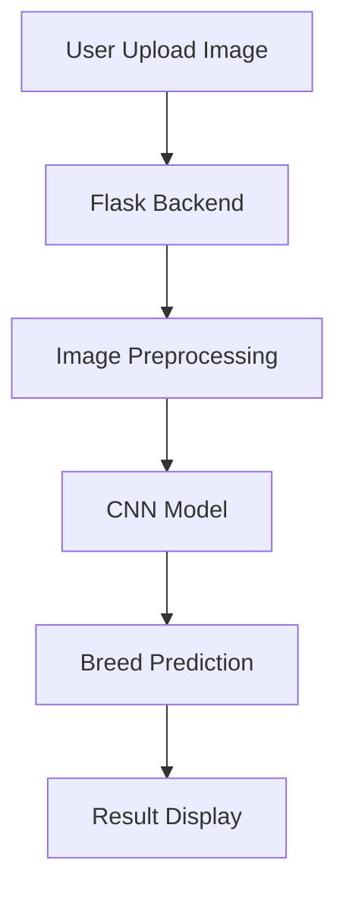

# LivestockAI

**Smart livestock intelligence for cattle and buffalo breed recognition**

## Technologies Used

- Frontend: HTML, CSS, JavaScript
- Backend: Python Flask
- AI: TensorFlow, CNN (MobileNetV2 compatible)
- Database: Firebase (project metadata and prediction logs)

## System Overview

A user uploads an image, the Flask backend receives it, preprocesses the image, passes it through the CNN model, and returns the predicted breed.



## Dataset Section

The dataset should include cattle and buffalo breeds commonly found in India. Each breed should have enough images for training, validation, and testing.

| Breed Type | Breed Name  | Number of Images | Image Format |
|------------|-------------|------------------|--------------|
| Cattle     | Gir         | 600+             | JPG / PNG    |
| Cattle     | Sahiwal     | 600+             | JPG / PNG    |
| Cattle     | Ongole      | 600+             | JPG / PNG    |
| Cattle     | Red Sindhi  | 600+             | JPG / PNG    |
| Buffalo    | Murrah      | 600+             | JPG / PNG    |
| Buffalo    | Surti       | 600+             | JPG / PNG    |

> Notes: Use well-lit, varied-angle, and high-resolution images. Maintain consistent naming conventions and a balanced class distribution.

## Modules

- Module 1 — Image Upload
  - User uploads image from the frontend.
- Module 2 — Image Processing
  - Resize and preprocess the photo for the model.
- Module 3 — Model Prediction
  - CNN predicts the breed label.
- Module 4 — Result Display
  - The predicted breed appears in the UI.

## Frontend UI

Required elements:

- Upload button
- Predict button
- Result section
- Image preview area
- Dark mode toggle
- Responsive design for mobile and desktop

## Backend

The Flask backend should:

- receive an image from the frontend
- load the trained model
- preprocess the image for the CNN
- predict the breed label
- return the result to the user

## Running the Project

1. Create a virtual environment:

```bash
python -m venv venv
.
venv\Scripts\activate
```

2. Install dependencies:

```bash
pip install flask tensorflow pillow
```

3. Run the Flask app:

```bash
python app.py
```

4. Open the browser at `http://127.0.0.1:5000`

## Notes

- Add a trained model file at `model/breed_classifier.h5`.
- Update the app branding to LivestockAI when deploying to production.
- Configure Firebase if you want to persist predictions or logs.
- MobileNetV2 is a recommended CNN backbone for efficient deployment.
